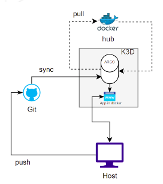

## DESCRIPTION:

Continuos integration with argosCD.

## SETUP K3D CLUSTER + ARGOCD:

  sudo sh setup.sh

1.- Create the cluster

sudo k3d cluster create p3

2.- Create two namespace: dev, argocd

sudo kubectl create namespace argocd

sudo kubectl create namespace dev

3.- Install Argocd in the namespace: argocd

sudo kubectl apply -n argocd -f ../confs/argocd_install.yaml

argocd_install.yaml is a template downloaded from https://raw.githubusercontent.com/argoproj/argo-cd/stable/manifests/install.yaml

Must wait to pods of argocd are ready:

sudo kubectl rollout status deployment argocd-redis -n argocd

sudo kubectl rollout status deployment argocd-server -n argocd

sudo kubectl rollout status deployment argocd-dex-server -n argocd

sudo kubectl rollout status deployment argocd-repo-server -n argocd

4.- Changing ARGOCD admin password to 'admin'

sudo argocd account bcrypt --password admin > password.log

sudo kubectl -n argocd patch secret argocd-secret -p '{"stringData": {"admin.password": "'$(sudo cat password.log)'","admin.passwordMtime": "'$(date +%FT%T%Z)'"}}'

sudo rm password.log

5.- setup our your aplication in ArgoCD:

sudo kubectl -n argocd apply -f ../confs/argocd_app_dperez.yaml

6.-  make ARGOCD UI accesible from "url : https://localhost:8080"

two ways:

>Change the argocd-server service type to LoadBalancer:
kubectl patch svc argocd-server -n argocd -p '{"spec": {"type": "LoadBalancer"}}'

>Port Forwarding

Kubectl port-forwarding can also be used to connect to the API server without exposing the service.

nohup sudo kubectl port-forward svc/argocd-server -n argocd 8080:443 >> argocdlogs.log 2>&1 & user:admin

The API server can then be accessed using https://localhost:8080

> With Ingress, see https://argo-cd.readthedocs.io/en/stable/operator-manual/ingress/

https://argo-cd.readthedocs.io/en/stable/getting_started/

CHEETSHEET

k3d cluster create
k3d cluster delete
k3d cluster list
k3d cluster start
k3d cluster stop

https://argo-cd.readthedocs.io/en/stable/getting_started/

Need to login in argo-cd server to run argocd commands.

argocd login localhost:8080 

argocd app list
argocd app get app_argocd_name  --> show status
argocd app sync app_argocd_name --> sync app

argocd app create guestbook --repo https://github.com/argoproj/argocd-example-apps.git --path guestbook --dest-server https://kubernetes.default.svc --dest-namespace default

apiVersion: argoproj.io/v1alpha1
kind: Application
metadata:
  name: argocd-wilapp
  namespace: argocd
spec:
  destination:
    namespace: dev
    server: https://kubernetes.default.svc
  project: default
  source:
    repoURL: https://github.com/zamazzal/iot-app.git
    path: .
    targetRevision: master
  syncPolicy:
    prune: true
    selfHeal: true

argocd app get guestbook  (view status of app)
Name:               guestbook
Server:             https://kubernetes.default.svc
Namespace:          default
URL:                https://10.97.164.88/applications/guestbook
Repo:               https://github.com/argoproj/argocd-example-apps.git
Target:
Path:               guestbook
Sync Policy:        <none>
Sync Status:        OutOfSync from  (1ff8a67)
Health Status:      Missing

argocd app sync guestbook (sync manually, This command retrieves the manifests from the repository and performs a kubectl apply of the manifests.)

secrets in argocd (user y password)
https://medium.com/@dulanjanalakmal/securing-argocd-a-step-by-step-guide-to-resetting-admin-passwords-bb5236208a64
https://kubernetes.io/docs/tasks/configmap-secret/managing-secret-using-kubectl/
https://github.com/argoproj/argo-cd/blob/master/docs/faq.md